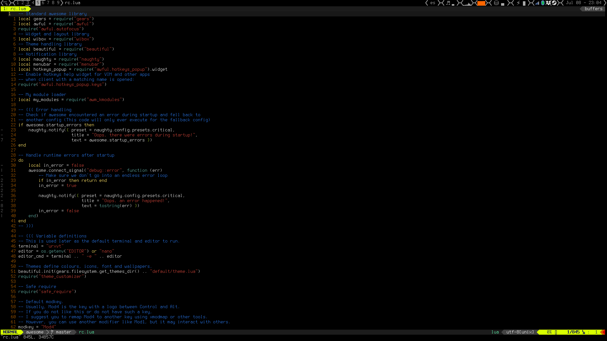

# AWM Config

**AWM Config** is my own configuration repository for [AwesomeWM 4](https://awesomewm.org/).

## Getting Started

Just clone it in your awesome configuration dir (usually ~/.config/awesome/)  
Don't forget to clone the submodules (some standalone modules I have in other
repo) too:
```
git clone --recurse-submodules https://github.com/Kuroneer/awm_config.git
```
This configuration uses [Lain](https://github.com/lcpz/lain) to display the
filesystem widget. The dependency is optional and it won't break if it's not
found.

# Screenshots



# Changes performed over the default configuration file

Changelog (not comprehensive):

* REMOVED: Mod4+w Keybind to open awesome menu removed
* REMOVED: Layout box widget
* REMOVED: On Top menu icon and binding
* REMOVED: On Top only for floating clients
* REMOVED: Mod4+x lua prompt
* REMOVED: Some layouts commented
* REMOVED: Removed borders
* REMOVED: Removed keyboard layout widget
* CHANGED: Remap urgent to Mod+ñ
* CHANGED: Theme
* CHANGED: Master width factor default to 0.65
* ADDED: Layout change notification
* ADDED: Screenshot binding
* ADDED: Screen lock binding
* ADDED: File explorer bindings
* ADDED: Screens layout in Mod4 + Shift + S - XF86Display types Super_L + P instead
* ADDED: Wibar height and theme variable to control it
* ADDED: Rule with size_hints_honor = false,
* ADDED: Notifications max icon size
* ADDED: Notifications with higher timeout with actions
* ADDED: Widget separators
* ADDED: Systray always in the best screen
* ADDED: Titlebar on floating windows only
* ADDED: Gradient color on focus (removed signal actions to change color)
* ADDED: Quake-like dropdown terminal
* ADDED: Spawn terminal in cwd
* ADDED: Brightness controls
* ADDED: Promptbox timeout to clear itself
* ADDED: Lain FS widget - only where relevant functions are available
* ADDED: Mod Arrow skips empty tags (wo minimized clients) if current is empty
* ADDED: Mod u/i behave as mod arrow right and left
* ADDED: Menu entries to shutdown, reboot and lock the screen with slock
* ADDED: Menu entries for file explorer, chromium, steam and vlc
* ADDED: Widget to query pacman and apt for updates
* ADDED: Mod+ X makes unfocusable client, Mod + Shift + X makes all clients focusable again
* ADDED: Tags are shared between screens
* ADDED: CPU and RAM widgets
* ADDED: Battery widget
* ADDED: Added media keys (Next/Previous/TogglePlay) through playerctl

## Authors

* **Jose M Perez Ramos** - [Kuroneer](https://github.com/Kuroneer)

## License

This project is released under the GPLv3. Check [LICENSE](LICENSE) for more information.

